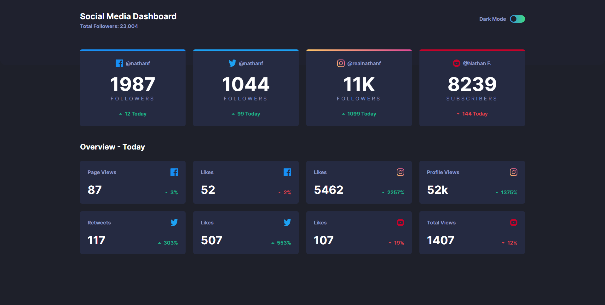
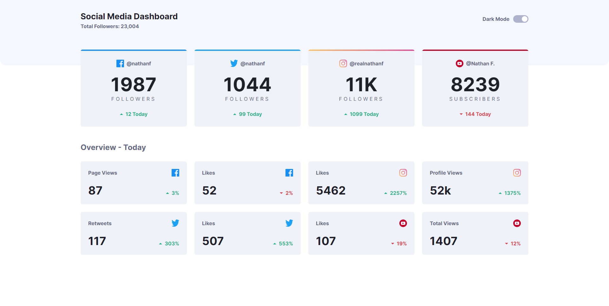

# Frontend Mentor - Social media dashboard with theme switcher

Esta é uma solução para o [Social media dashboard with theme switcher challenge on Frontend Mentor](https://www.frontendmentor.io/challenges/social-media-dashboard-with-theme-switcher-6oY8ozp_H).

### O desafio 💻

Os usuários devem ser capazes de:

- Ver o layout ideal para o componente em função do tamanho do ecrã do seu dispositivo
- Ver os estados de hover de todos os elementos interactivos da página
- Alternar o tema de cor de acordo com a sua preferência

### Screenshot

### Links

- **Repositório URL**: [https://github.com/gbmouraa/social_media_dashboard](https://github.com/gbmouraa/social_media_dashboard)
- **Live Site URL**: [https://gbmoura-social-media-dashboard.netlify.app/](https://gbmoura-social-media-dashboard.netlify.app/)

### Tecnologias Utilizadas :rocket:

- **React**: Uma biblioteca JavaScript popular para construir interfaces de usuário interativas.
- **Tailwind CSS**: Um framework CSS que oferece várias classes para utilização já pré-estilizadas.

## Autor

- **Portfólio** - [Gabriel Moura](https://gmouradev.netlify.app/)
- **Frontend Mentor** - [@gbmouraa](https://www.frontendmentor.io/profile/gbmouraa)
- **Linkedin** - [Gabriel Moura](https://www.linkedin.com/in/gabriel-moura-b63382161/)
